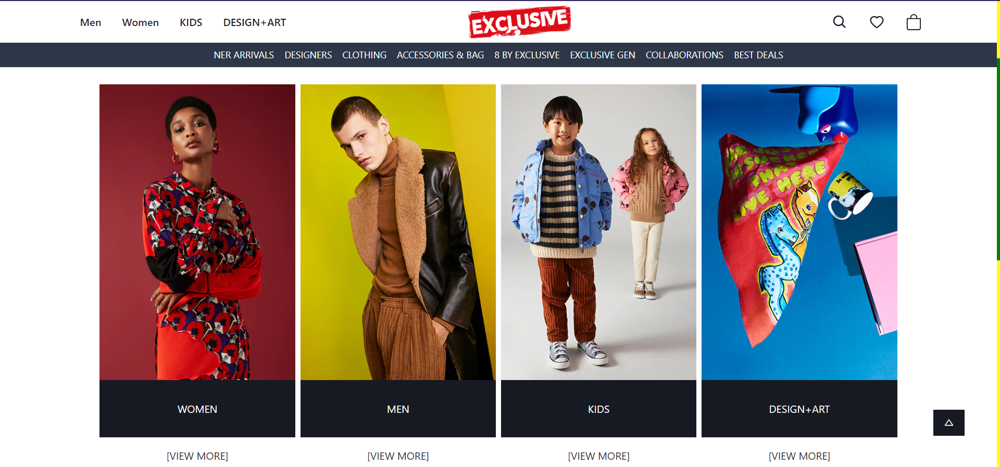

## Dot & Key Clone

Hello everyone, we are a group of 5 members cloning a website 'Yoox' in our construct week at Masai School.
- Vercel Link:- 
- Backend Link:- 

## Features

- Animations on carousels.
- Manual and automatic carousels.
- Sort & filter by many options on product page.
- Offcanvas on cart page.
- Get a smooth experience in payment, login & signup process.

## Screenshots

### 1. Home Page

### 2. Login Page

### 3. Signup Page

### 4. Products Page

### 5. Product View Page

### 6. Cart Modal

### 6. Checkout Page

## Tech Stack

- [HTML](https://developer.mozilla.org/en-US/docs/Web/HTML)
- [CSS](https://developer.mozilla.org/en-US/docs/Web/CSS)
- [JS](https://developer.mozilla.org/en-US/docs/Web/JavaScript)
- [NextJS](https://nextjs.org/)
- [MongoDB](https://www.mongodb.com/)
- [Chakra-UI](https://chakra-ui.com/)

## Connect with authors

- [Harshal Pardeshi](https://www.linkedin.com/in/harshalpardeshi/)
- [Sathan Kumar]()
- [Swapnil Kushwaha]()
- [Radhe Shyam Soni]()
- [Sanjay Gupta]()

## Feedback

If you have any feedback or queries, please reach out to us at pardeshiharshal90@gmail.com.
